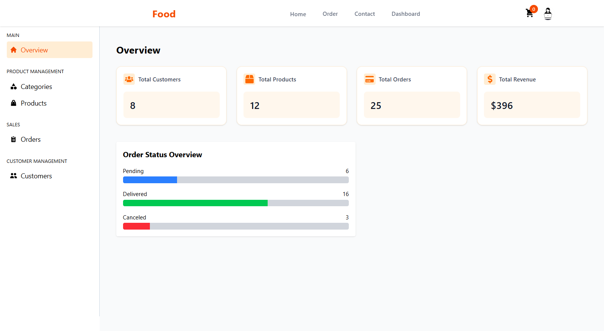

# 🍔 Food Delivery System

A modern and responsive **Food Delivery Web Application** where customers can explore menus, add to cart, place orders, and manage their profile. It also includes an **Admin Panel** for managing customers, orders, and products.

---

## 📸 Screenshot

Below is a preview of the **Admin Dashboard**, where you can view statistics, manage customers, products, and orders.

---

## ✨ Features

### 👤 User Side
- Sign Up and Sign In functionality
- Home page with featured items
- Add to Cart & Place Order
- Profile Page for updating details
- Contact Us section

### 🛠️ Admin Panel
- Overview Dashboard with revenue, orders, and status stats
- Manage Customers
- Manage Products
- View & Manage Orders
- Delivery status tracking

---

## 💻 Technologies Used

- [React.js](https://reactjs.org/) — Frontend library
- [Tailwind CSS](https://tailwindcss.com/) — Utility-first CSS framework
- [Supabase](https://supabase.com/) — Backend-as-a-Service (Database + Auth)
- [React Icons](https://react-icons.github.io/react-icons) — Icon library for React

---

## 🔐 Admin Access

To log in as an **admin**, use the following credentials:

**Email:** `admin@gmail.com`  
**Password:** `654321`

---

